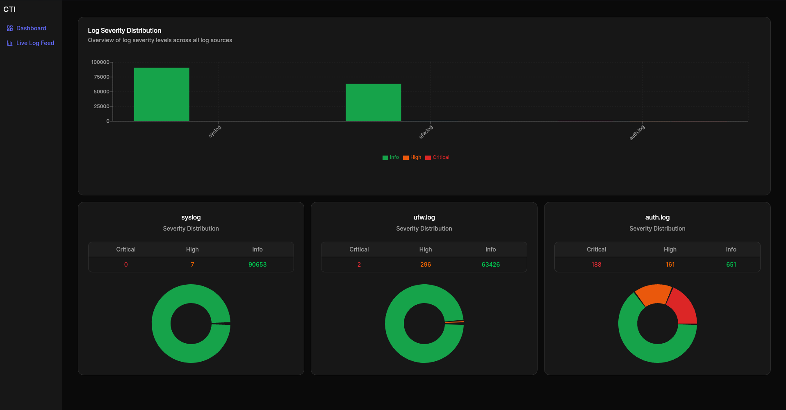
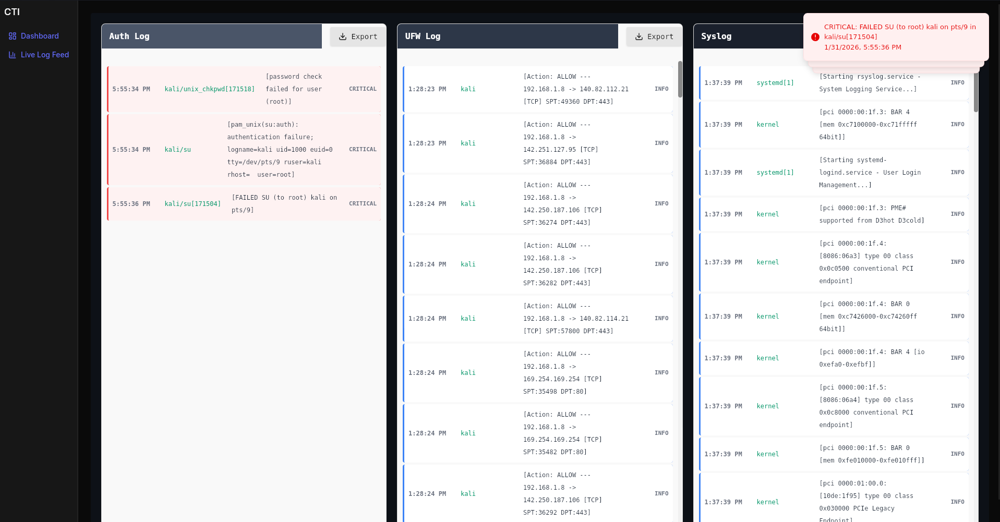
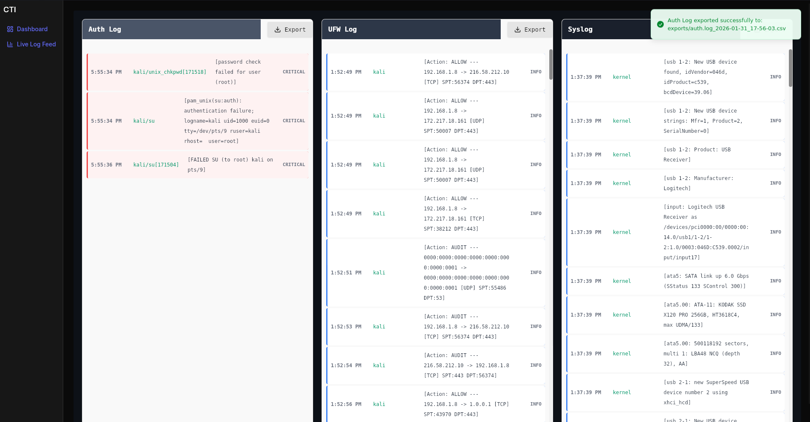

# Log-Analyzer

Log-Analyzer is a desktop application for monitoring system logs in real-time. Built with **Wails v3** (Go backend) and **React** (TypeScript/TSX frontend).

## 🎯 Features

- **Real-Time Log Monitoring**: Live tracking of multiple log sources with automatic updates
- **Supported Log Sources**:
  - `/var/log/auth.log` - Authentication and user access events
  - `/var/log/syslog` - System events, services, and applications
  - `/var/log/ufw.log` - Firewall rules and network activity

- **Log Parsing**: Regex-based parsers extract structured data from raw log entries
- **Rule-Based Severity Classification**: Customizable rules in rules.yaml file
- **Alert System**: Notification for Critical level log entries
- **Log Export**: Export filtered logs to CSV file
- **Database**: SQLite3 database
- **Dashboard Analytics**: Real-time charts showing log distribution by severity and source


### Installation

1. **Clone the repository**
   ```bash
   git clone https://github.com/aKeles001/Log-Analyzer.git
   cd Log-Analyzer/log-analyzer
   ```

2. **Build Docker Container**
   ```bash
   docker build -t wails-development:latest .
   ```

3. **Start the Container**
   ```bash
   docker-compose up -d
   ```

4. **Run the application**
   ```bash
   docker-compose exec -it wails-development bash
   ```
   ```bash
   cd log-analyzer
   ```
   ```bash
   wails3 dev
   ```

## Application

### Dashboard
- View real-time log statistics.
- Filter by severity level (CRITICAL, HIGH, INFO)
- See distribution charts for each log source

### Live Log Feed
- Monitor logs as they're processed in real-time
- Click **Export** button to save filtered logs as CSV
- Critical events trigger toast notifications

### Log Export
- Export logs to CSV format for analysis
- Export to `./exports/` directory


### Rules Engine (`rules/rules.yaml`)

Define custom rules for log classification:

Rule examples:
```yaml
- name: "Failed SSH Attempt"
  pattern: "Invalid user.*"
  severity: "HIGH"

- name: "Root Access Blocked"
  pattern: "user=root.*authentication failure"
  severity: "CRITICAL"

- name: "Successful Login"
  pattern: "Accepted password for.*"
  severity: "INFO"
```

**Rule Structure:**
- `name`: Rule name
- `pattern`: Regex pattern to match against log messages
- `severity`: One of `CRITICAL`, `HIGH`, `INFO`


### Development Stack

**Frontend Technologies:**
- React 18+ with TypeScript/TSX
- Tailwind CSS for styling
- Shadcn UI component library
- Recharts for data visualization
- Sonner for toast notifications
- Vite for fast development server

**Backend Technologies:**
- Go 1.21+ with Wails v3
- SQLite3


## 🐛 Troubleshooting

### Logs Not Appearing
Logs are mounted into docer container from '/var/log' mounting process might fail.
1. Verify log files exist: `ls -la /var/log/{auth,syslog,ufw}.log`
2. Check permissions: `sudo chmod 644 /var/log/*.log`
3. Restart the application

### Database Issues

```bash
rm log-analyzer/db/database.db
```
```bash
sqlite3 log-analyzer/db/database.db < log-analyzer/db/schema.sql
```

### Application Not Apearing
You need to run this command one time before starting the application to give docker proper permissions.
```bash
xhost +local:docker
```
### Images






